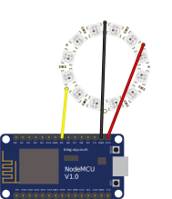
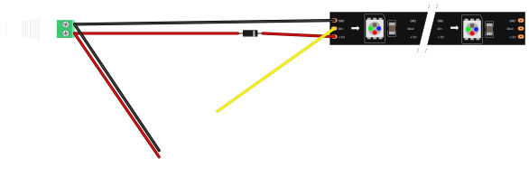

# ESP8266-MQTT-JSON-Lights [](https://travis-ci.org/timmo001/ESP8266-MQTT-JSON-Lights)
ESP8266 MQTT JSON Lights. Supports brightness, effects, speed and OTA uploads. Based on https://github.com/DotNetDann/ESP8266-MQTT-JSON-SK6812RGBW-HomeAssistant and https://github.com/bruhautomation/ESP-MQTT-JSON-Digital-LEDs

## Known working devices
- WS2812 5v LED Ring
- WS2811 5v LED String (Required `NEO_GRB` to be changed to `NEO_RGB` on line 56 in `main.cpp` for my set of lights)

> This is not a comprehesive list by any means. Just devices I / others have tested are working. Feel free to try uploading to your own device and add a pull request if your device works also.

## Hardware Setup
See [bruhautomation's guide](https://github.com/bruhautomation/ESP-MQTT-JSON-Digital-LEDs/blob/master/README.md) for initial hardware setup.

My version of is a bit more simple and only requires a 5v power supply with high enough amperage to drive:

### USB Neopixel WS2812 Ring/Strip Version

> A 5V power supply may be required if your lights draw too much current.
> If this happens or you are planning to use more than 30 leds or so, use the below method.

### 5v PSU Neopixel WS2811 String/Strip Version

> The diode / zenner diode isn't required, but I added it to avoid any reverse current issues.
> You can drive over 100 LEDs without issues on this method. You may however have to add a wire from the PSU +5v to sections of the wire if you experience dimming along the string/strip.

## Software Setup
- Rename `src/setup-template.h` to `src/setup.h` and add your network, MQTT and lighting setup information. Take note of the `deviceName` you set. You will need this later to send MQTT messages.
- Using Atom or VS Code, install [Platform IO](https://platformio.org/platformio-ide)
- Once setup, install the `esp8266` embedded platform
- Install library dependencies:
  - Adafruit NeoPixel
  - ArduinoJson
  - PubSubClient
- Build the project (Ctrl+Alt+B) and check for any errors
- Upload to your board of choice (Ctrl+Alt+U). This project was created specifically for the `NodeMCU` but can be configured to work with another WiFi board with some tinkering.

## Example Home Assistant Configuration
```yaml
light:
  platform: mqtt_json
  name: 'LED Lights'
  state_topic: 'light/led'
  command_topic: 'light/led/set'
  effect: true
  effect_list:
    - static
    - blink
    - breath
    - color wipe
    - color wipe inverted
    - color wipe reverse
    - color wipe reverse inverted
    - color wipe random
    - random color
    - single dynamic
    - multi dynamic
    - rainbow
    - rainbow cycle
    - scan
    - dual scan
    - fade
    - theater chase
    - theater chase rainbow
    - running lights
    - twinkle
    - twinkle random
    - twinkle fade
    - twinkle fade random
    - sparkle
    - flash sparkle
    - hyper sparkle
    - strobe
    - strobe rainbow
    - multi strobe
    - blink rainbow
    - chase white
    - chase_color
    - chase random
    - chase rainbow
    - chase flash
    - chase random
    - chase rainbow white
    - chase blackout
    - chase blackout rainbow
    - color sweep random
    - running color
    - running red blue
    - running random
    - larson scanner
    - comet
    - fireworks
    - fireworks random
    - merry christmas
    - fire flicker
    - fire flicker soft
    - fire flicker intense
    - circus combustus
    - halloween
    - bicolor chase
    - tricolor chase
    - icu
  brightness: true
  rgb: true
  optimistic: false
  qos: 0

input_number:
  led_effect_speed:
    name: 'LED Effect Speed'
    initial: 50 # This is the default speed
    mode: slider
    min: 10  # ######################################
    max: 150 # Feel Free to adjust these as you like
    step: 10 # ######################################

automation:
  - action:
      - alias: Set LED Lights Effect Speed
        service: mqtt.publish
        data_template:
          topic: light/led/set
          payload: '{"speed":{{ trigger.to_state.state | int }}}'
    alias: LED Light Effect Speed
    trigger:
      - platform: state
        entity_id: input_number.led_effect_speed
```

> The speed of the lights will be slower the higher the slider value and faster the lower the value. Treat this more as a delay slider than a speed slider.

## Sample MQTT Payload
```json
{
  "brightness": 120,
  "color": {
    "r": 255,
    "g": 255,
    "b": 255
  },
  "effect": "rainbow cycle",
  "speed": 60,
  "state": "ON"
}
```
